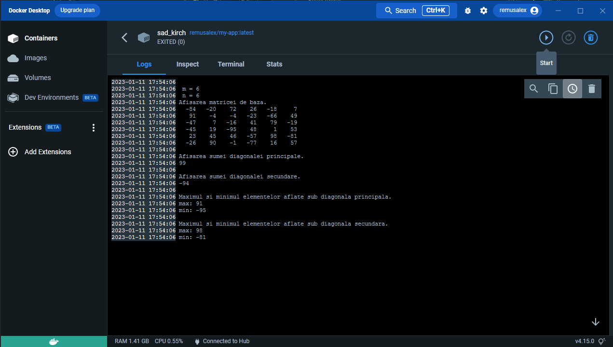
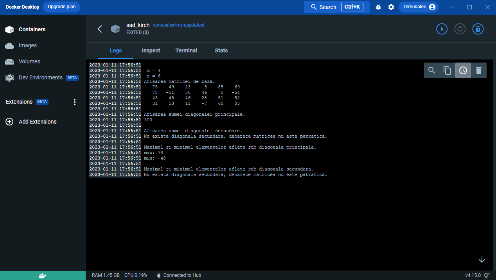

# Proiect sincretic 

Am decis sa imi aleg proiectul cu numarul 14, cerinta fiind aceasta: 
Se da o matrice de dimensiunea M x N, generata aleatoriu. Se cere sa se calculeze: 

a) Suma elementelor aflate pe diagonala principala,
respectiv pe diagonala secundara 
b) Minimul si maximul elementelor aflate sub diagonala principala, respectiv sub diagonala secundara.

Este un proiect relativ usor de implementat, acesta fiind motivul principal pentru care am decis sa il aleg.

Initial am adaugat functii de citire si de afisare a matricelor, pentru a testa urmatoarele functii scrise ce au legatura
cu valorile diagonalei principale si secundare si valorile de sub ele. La final am implementat ca liniile si coloanele sa
fie date aleatoriu cu ajutorul functiilor srand(time(0)) si rand(), cu o limita de 10 linii si 10 coloane. Dupa aceea am 
facut ca valorile din matrice sa fie aleatoriu alese din intervalul (-99, 99), folosind o formula, deorarece limbajul C nu 
are o functie pentru a alege un numar la intamplare dintr-un interval.

In acest timp am folosit GitHub pentru a-mi salva codul intr-un repository, deoarece am lucrat de pe mai multe calculatoare
si pentru a avea un backup.

La final am creat o imagine a programului sursa in Docker cu ajutorul unui fisier Dockerfile si cateva comenzi in terminal
pentru a-l rula intr-un container, pentru testarea rapida a programului, fiind posibil sa fie rulat si de alte persoane cu 
ajutorul aplicatiei, deoarece este postat public.

Aici este primul exeplu, unde numarul de linii si coloane este egal; rezulta faptul ca exista o diagonala secundara si se
pot utiliza valorile ei is de sub ea.

In al doilea exemplu, numarul de linii si de coloane este diferit, nefiind existenta diagonala secundara apare o avertizare
ce spune ca ea nu exista si nu se pot face calcule in functie de acea diagonala.

Bibliografie:
https://docs.docker.com/get-started/overview/
https://www.includehelp.com/c-programs/generate-random-numbers-within-a-range.aspx